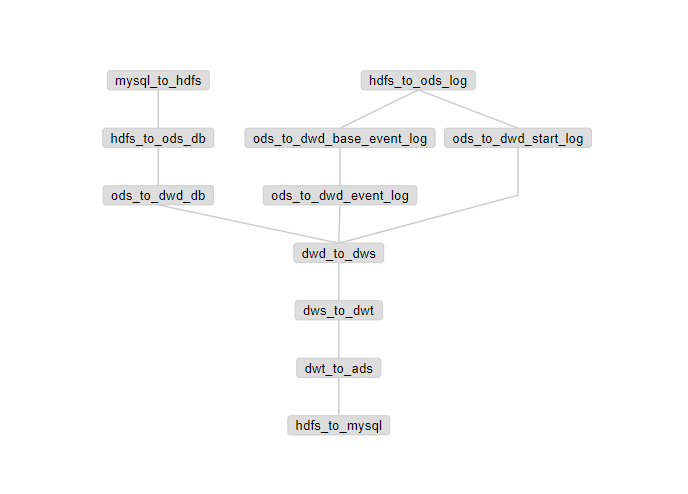

## 离线数仓

##### 框架

| 名称      | 版本     |
| --------- | -------- |
| Hadoop    | 2.7.2    |
| Zookeeper | 3.4.14   |
| Kafka     | 0.11.0.0 |
| Hive      | 2.3.6    |
| Sqoop     | 1.4.6    |
| Flume     | 1.7.0    |
| Hbase     | 1.3.6    |
| Tez       | 0.9.1    |
| Azkaban   | 2.5.0    |
| Presto    | 0.196    |
| Imply     | 2.7.10   |
| Zabbix    | 4.2.8    |

框架安装：https://www.jianshu.com/u/ffc8f44b1b9f

脚本执行顺序

